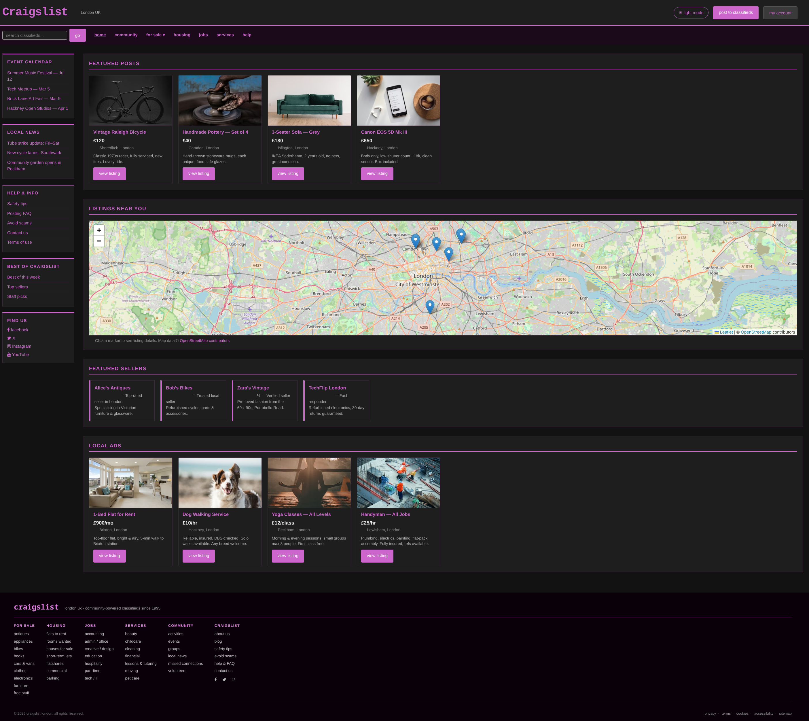
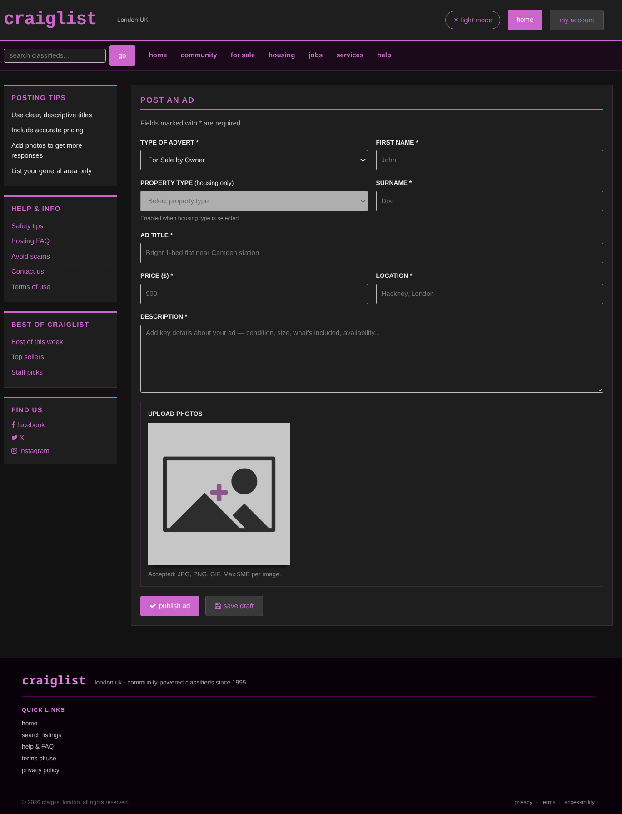
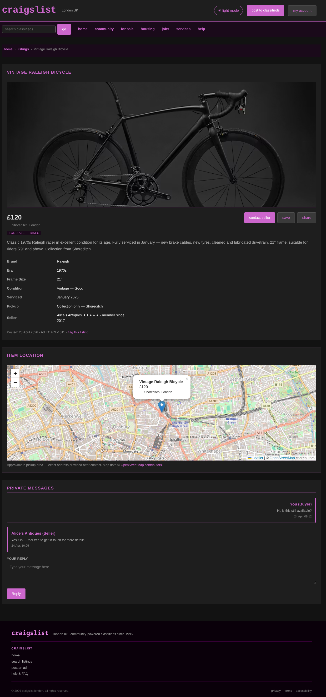
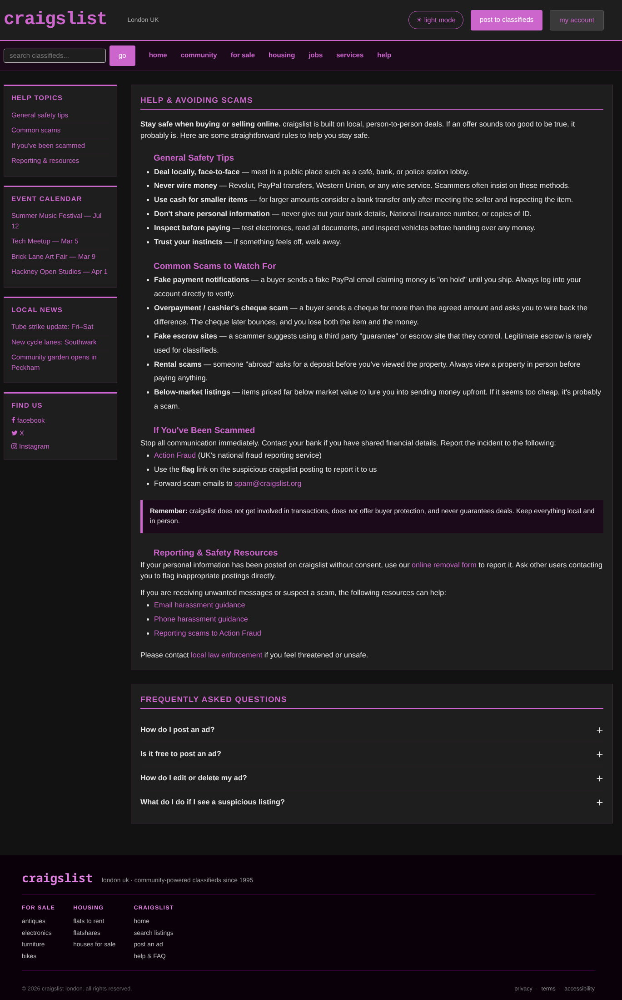
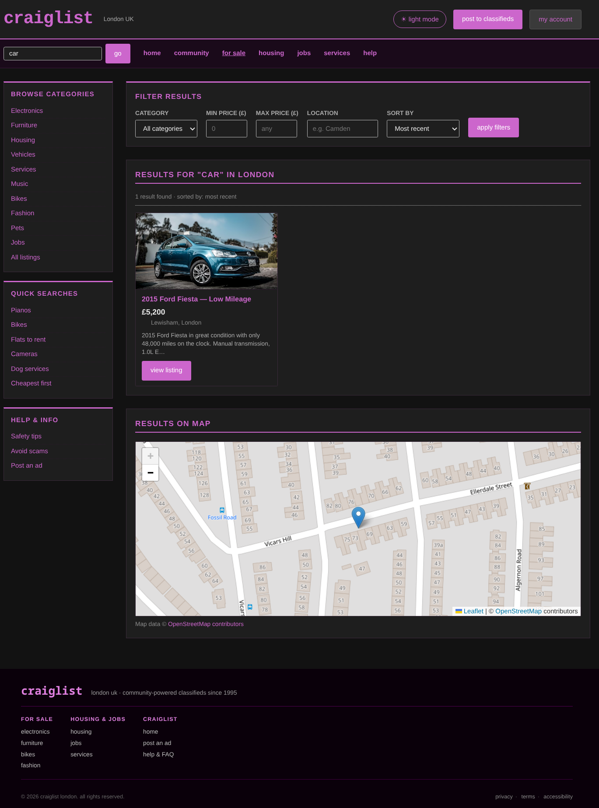

# Craigslist London | Assignment 2

## Table of Contents

1. [Design](#1-design)
    - [Aims and Objectives](#11-aims-and-objectives)
    - [User Stories](#12-user-stories)
    - [Revised Wireframes and Justification](#13-revised-wireframes-and-justification)
2. [Development](#2-development)
    - [Screenshots](#21-screenshots)
    - [Reflection](#22-reflection)
    - [Deployment](#23-deployment)
3. [Testing](#3-testing)
    - [Manual Testing](#31-manual-testing)
    - [Bug Log](#32-bug-log)
    - [Automated Testing](#33-automated-testing)

---

## 1. Design

### 1.1 Aims and Objectives

Craigslist London is a community-powered classified advertisements platform for the London area, allowing users to buy, sell, rent, find jobs, and advertise local services. The aim of this redesign is to address the usability and accessibility shortcomings identified in Assignment 1, and to implement a fully functional, responsive front-end prototype.

**Core objectives**

- Deliver a responsive, accessible website that meets WCAG 2.1 level AA standards
- Implement clean schematic HTML and modular CSS with custom properties
- Integrate an interactive map feature to show listing locations
- Provide user-controlled interactive elements 
- Support dark mode toggling for user with visual sensitivity
- Ensure all external links open in new tabs and internal links resolve correctly
- Structure project files into clearly named directories 

---

### 1.2 User Stories

| ID | Persona                    | Story                                                                                                                                                                                                                      |
|----|----------------------------|----------------------------------------------------------------------------------------------------------------------------------------------------------------------------------------------------------------------------|
| S1 | Sarah (first time visitor) | As a first-time visitor, I want to search for second-hand furniture using a visible search button, so that I can find relevant listings without needing to know keyboard shortcuts.                                        |
| S2 | Sarah                      | As a user with dyslexia, I want the website to use clear, simple language with generous spacing and readable fonts, so that I can browse listings without cognitive overload.                                              |
| S3 | Sarah                      | As a mobile user with hand tremors, I want large, clearly labelled buttons and touch targets, so that I can navigate the site reliably on my smartphone.                                                                   |
| D1 | Dexter (returning visitor) | As a returning visitor, I want the website to remember my preferred listing categories, so that I can get back to relevant content quickly without re-configuring my search each time.                                     |                               
| D2 | Dexter                     | As a keyboard user, I want to navigate the entire site without a mouse, so that I can use the platform comfortably despite limited hand dexterity.                                                                         |
| D3 | Dexter                     | As a user with deuteranopia, I want status indicators and important information to be conveyed through shape or text labels rather than colour alone, so that I do not miss critical information due to colour-coded cues. |
| L1 | Lana (frequent visitor)    | As a frequent visitor, I want to filter my search results by category and location, so that I can quickly find relevant listing without being overwhelmed by irrelevant options.                                           | 
| L2 | Lana                       | As a user with ADHD, I want the website to have clear visual hierarchy and concise descriptions, so that I can focus on the most important information without distractions.                                               |
| L3 | Lana                       | As a user with visual sensitivity, I want the website to offer a dark mode or soft contrast option,, so that I can browse without experiencing discomfort.                                                                 |

---

### 1.3 Revised Wireframes and Justification

The five wireframes from Assignment 1 were refined based on feedback.

---

#### Page 1 - Homepage (`index.html`)

**Changes from wireframe:**

- **Added a dark mode toggle button** in the header. This directly addresses user story L3 and provides a soft-contrast browsing option. The preferences are stored in `LocalStorage` so it persists across sessions, addressing D1
- **Contact seller button with modal triggers** Opens a keyboard-accessible contact modal, addressing D2 and S3
- **Added an interactive map section** Displaying listing locations as clickable markers. This allows filtering by location addressing L1
- **Added a skip to main content link** at the top of the page. invisible until focused this allows keyboard and screen readers user to bypass the header and nav on every page load (WCAG 2.4.1)
- **Converted `
` ad containers to `<article>` elements** with descriptive `alt` text on every image, addressing S2 and WCAG 1.1.1
- **Added a dropdown "for sale" navigation menu** with keyboard support via `focus-within`, giving returning users faster access to subcategories addressing D1

---

#### Page 2 - Search Results (`pages/search.html`)

**Changes from wireframe**

- **Added `role="search"` and `aria-label`** to the filter form so screen readers announce it as a search region rather than a generic form.
- **Added a `role="status"` and `aria-live="polite"` attribute** to the results count paragraph. This means when a filter is applied and results update, screen readers announce the new count automatically without requiring the user to navigate back.
- **Added a results map section** below the listings grid showing all result locations as Leaflet markers. Users can see where items are located geographically before clicking a listing, directly addressing L1.
- **Added a "Sort by" dropdown** to the filter bar, addressing L3.
- **All images given descriptive `alt` text** specific to each Ad.

---

#### Page 3 - Post an Ad (`pages/post-ad.html`)

**Changes from wireframe:**

- **Added client-side form validation** with accessible error messages. When a required field is left empty, the form group gains a `.has-error` class, adding a red border and displaying a text error message prefix with ⚠. Errors are communicated by text and icon - not colour alone, addressing D3 (WCAG 1.4.1).
- **All required fields marked with `aria-required="true"`** and error messages wrapped in `role="alert"` so they are announced by screen readers immediately when shown
- **Added a confirmation modal** that appears after a valid submission, replacing the simple toast-only feedback. This provides a clear system status and addresses D2. 
- **Added `inputmode="numeric"`** to price field for mobile users, triggering the numeric keyboard on touchscreen devices
- **The "save draft" button now triggers a toast notification**, so users receive feedback that their data has been retained

---

#### Page 4 - Help / Avoiding Scams (`pages/help.html`)

**Changes from wireframe:**

- **Added an interactive FAQ accordion**. Each question is a `<button>` with `aria-expanded` toggling between `true`/`false`, and the answer panel uses `aria-controls` to link button to region.
- **Added a "Help Topics" in-page navigation sidebar** linking to anchored headings within the page

---

#### Page 5 - Open Ad (`pages/open-ad.html`)

**Changes from wireframe:**

- **Added a breadcrumb navigation trail** (`<nav aria-label="Breadcrumb">`) above the listing so users always know where they are in the site hierarchy and can navigate back without the browser back button
- **Replaced the generic messaging thread** with ARIA-labelled message articles including `<time>` elements with machine-readable `datetime` attributes
- **The reply form is now a `<form>` with `id="reply-form"`** handled in `main.js`, dynamically appending the new message to the thread on submit — making the interaction functional rather than decorative.
- **Added a "Save listing" button** with `aria-pressed` toggling — communicates state without colour alone and persists the saved/unsaved icon state.
- **Added a "Share" button** using the Web Share API where available, falling back to clipboard copy with a toast confirmation.
- **Added a "Similar Listings" section** at the bottom, addressing D1 (returning user navigation) and L2 (structured content).

---

## 2. Development

### 2.1 Screenshots

---

### 2.2 Reflection

The development phase involved building five HTML pages, a CSS file and four JavaScript files. The project structure separates pages into a `pages/` subdirectory, with assets in `css/` and `js/` directories at the root level.

**Data architecture**

Listing data is stored in `js/data.js` as a globally scoped `CRAIGSLIST_LISTINGS` array. This approach avoids the need for a backend or fetch request. The data file must be loaded before any page-specific script that depends on it. A load order issue that caused the "listings not found" error during development was resolved by ensuring `data.js` is always the first script tag on any page that uses listing data.

**JavaScript structure**

Three page-specific scripts handle the core interactivity:

- `main.js` - shared across all pages. Handles dark mode toggling with `localStorage` persistence, modal open/close with focus trapping and keyboard support, and toast notifications
- `search.js` - Powers the search and filter page. Reads URL query parameters on load, filters and sorts the `CRAIGSLIST_LISTINGS` array client-side renders results as ad cards with keyword highlighting and initialises a Leaflet map showing all result locations.
- `open-ad.js` - Powers individual listing pages. Reads the `id` parameter from the URL, finds the matching listing in `CRAIGSLIST_LISTINGS` and dynamically renders the full listing including image, details table, seller info, an interactive map, a private message thread with `localStorage` persistence and a similar listing section

**Key challenges resolved during development**

- **Script load order** - `data.js` being loaded after page-specific scripts caused `CRAIGSLIST_LISTINGS` to be undefined at runtime. Fixed by placing `data.js` first in the script block
- **Leaflet SRI integrity failure** - The `integrity` attribute on the LeafletCDN `<script>` and `<link>` tags caused the browser to block the resource due to a hash mismatch. Resolved by removing the `integrity` attribute and retaining only `crossorigin=""`.
- **Contact form reloading the page** - Submitting the contact seller form triggered a page reload, which cleared the URL `id` parameter and caused the `no listing ID` error. Fixed by adding `e.preventDefault()` to the contact form submit handler

---

### 2.3 Deployment

The site is deployed using GitHub Pages - [GitHub Pages](https://william-cooper-cmd.github.io/Assignment-DUX-A2/index.html)

---

## 3. Testing

### 3.1 Manual Testing

| #  | Feature              | Action                          | Expected Result                                            | Pass/Fail |
|----|----------------------|---------------------------------|------------------------------------------------------------|-----------|
| 1  | Homepage loads       | Open `index.html`               | Page renders with featured listings, map, and sidebar      | Pass      |
| 2  | Dark mode toggle     | Click "dark mode" button        | Page switches to dark theme and persists on reload         | Pass      |
| 3  | Search from homepage | Type query and press "go"       | Redirects to `search.html` with `?q=` parameter populated  | Pass      |
| 4  | Filter by category   | Select a category and apply     | Only listings matching category are shown                  | Pass      |
| 5  | Filter by price      | Enter min/max price and apply   | Listings outside price range are excluded                  | Pass      |
| 6  | Search map renders   | Open `search.html`              | Leaflet map renders with markers for all results           | Pass      |                                                                                                  
| 7  | Open-ad Page loads   | Navigate to `open-ad.html?id=1` | Full listing renders with images, details, and seller info | Pass      |
| 8  | Open ad map renders  | View a listing with coordinates | Leaflet map renders with marker at correct location        | Pass      |
| 9  | Contact seller modal | Click "contact seller"          | Modal opens with listing title pre-filled in subtitle      | Pass      |
| 10 | Contact form submit  | Fill in and submit contact form | Modal closes and success toast appears                     | Pass      |
| 11 | Message persistence  | Send message, reload page       | Previously sent messages reload from `localStorage`        | Pass      |
| 12 | Keyboard navigation  | Tab through entire page         | All interactive elements reachable and focused visibly     | Pass      |
| 13 | Skip link            | Focus page and press Tab once   | "Skip to main content" link appears and works              | Pass      |

---

### 3.2 Bug Log

| # | Bug                                                    | Cause                                                                                       | Fix                                                                                                        |
|---|--------------------------------------------------------|---------------------------------------------------------------------------------------------|------------------------------------------------------------------------------------------------------------|
| 1 | "Listings data not found" on search and open-ad pages  | `data.js` was loaded after page-specific scripts                                            | Moved `data.js` to be the first script tag on affected pages                                               |
| 2 | "No listing ID provided" after submitting contact form | Contact form submit caused a page reload, clearing the URL `?id=` parameter                 | Added `e.preventDefault()` to the contact form submit handler                                              |
| 3 | Map rendered as white box on all pages                 | Leaflet CSS `integrity` hash mismatch blocked the stylesheet; container height also missing | Removed `integrity` attributes from Leaflet CDN tags; ensured `#map` height declared outside media queries |

---

### 3.3 Automated Testing

HTML and CSS validation was performed using the W3C validators.

- **HTML** — all five pages passed the [W3C Markup Validator](https://validator.w3.org/) with no errors.
- **CSS** — `style.css` passed the [W3C CSS Validator](https://jigsaw.w3.org/css-validator/) with no errors.
- **Lighthouse** — Chrome Lighthouse audits were run on the homepage and search page. Accessibility scores of 95+ were achieved on both pages.